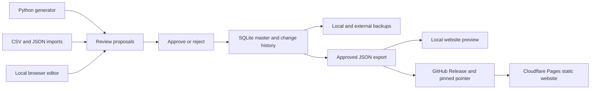

# Lazverbcon remake: architecture and migration

Updated: 2 October 2026. Status: core rule migration complete. The typed engine, SQLite publisher, API and mobile-friendly website are implemented. All twelve paradigms use named rule stages; the legacy snapshot is test-only. See the [setup guide](../README.md) for the actual repository layout and [migration notes](../migration/README.md) for coverage and unresolved data issues.

## Current implementation

The website uses **React, TypeScript and Vite** and runs on Cloudflare Pages
without an API server. The local **FastAPI admin** runs only on loopback, with a
bundled JavaScript/CSS editor and a persistent **SQLite master**. It is packaged
for Windows with PyInstaller. The **Python engine** generates review proposals;
approval changes the master. Manual exceptions do not need a corresponding rule.

Approved snapshots become JSON shards. Publishing puts the ZIP in a GitHub
Release and commits a checksum-pinned pointer; Pages downloads that export and
builds the website. The working database, drafts and history stay local.
See [admin setup](admin-app.md) for the workflow and remaining deployment checks.

The API and generated-catalog sections below also describe the retained optional
server deployment. That path remains useful for engine development and comparison.

The database recommendation was revised after discussing the write-once/read-many workload. PostgreSQL was initially proposed partly for possible future editorial workflows; those are deferred and do not justify a separate database service now.

The user confirmed that a mobile-friendly website is the first target and that an admin editor can wait until the conjugator works. A future native app can call the same API. Fully offline conjugation would need a separate decision about distributing generated forms or running the engine on-device.

The main maintainability improvement comes from separating linguistic rules, lexical data, API contracts and presentation. Changing Flask alone would not solve the current problems.

## Historical source audit

| Finding | Evidence | Consequence |
| --- | --- | --- |
| There are three conjugation paths. | `backend/notebooks/*.py` with `backend/conjugation.py` and `backend/services/conjugation.py`; the later `backend/conjugator/` classes; the current `backend/app.py` database lookup. | Establish a reference implementation before refactoring. |
| The original rules are mostly Python modules despite the directory name. | Twelve rule modules under `backend/notebooks/`, plus shared utilities and data loading. | Keep Python and make the rules importable without starting a web server. |
| The later rewrite is incomplete. | `backend/conjugator/past_conjugator.py:57` and `:70` contain unimplemented conjugation branches. A sampled ergative past call returned `None`. | Reuse individual ideas only after checking behavior against the original. |
| Database access has diverged. | `backend/db.py` opens SQLite, while `backend/db_query.py` creates a SQLAlchemy engine and uses PostgreSQL-specific query types. Both use `DATABASE_URL`. | Use one database configuration and migration history. |
| Lexical identity is more complex than an infinitive. | The CSV/JSON has 327 rows and 299 distinct infinitive spellings, across IVD, TVE and TVM. | Preserve distinct entries, classes, senses and dialect variants with stable IDs. |
| There is a substantial historical output corpus. | `lazverbcon.sql` contains 751 dialect-specific verb rows and 567,841 verb-form rows. | Use this as comparison evidence and preserve reverse lookup. The counts do not prove linguistic coverage. |
| The frontends speak different API vocabularies. | `VerbConjugator.jsx` and `v2/VerbDetails.jsx` differ in person codes, dialect codes, request shape and mood encoding. | Define one API schema and generate the TypeScript client from it. |
| Existing tests are useful but insufficient for parity. | `tests/test_api.py` expects an older response shape; `test_conjugations.py` compares only the first common response key. | Compare every dialect, grammatical analysis and accepted surface variant. |

Paths in this table refer to the retired `laz_verb_conjugator/` tree, except the
root SQL dump. These are historical findings, not current application files.
See [the archive and recovery instructions](legacy-archive.md).

Two data losses deserve explicit migration cases. The old loader overwrites six same-category duplicate infinitives. The SQL export also collapses spelling/dialect pairs even though 52 such pairs have multiple categories in the source data. The export notebook's saved output records generation errors and later dropped rows; all stored optional-prefix values are null. Preserve the original records and review these differences before declaring the dump complete.

## Stack

| Area | Choice | Reason |
| --- | --- | --- |
| Website | React + TypeScript + Vite | Retains familiar UI tools while making request, response and state mismatches easier to catch. |
| Navigation and data | URL search state + TanStack Query | Shareable conjugations, request cancellation, loading states and cached server data. |
| Styling | Tailwind CSS with a small shared component set | One styling approach and reusable accessible controls. |
| API | FastAPI + Pydantic | Explicit request/response models, validation and an OpenAPI contract. |
| Linguistic engine | Typed Python, dataclasses and enums | Preserves the language of the original rules and keeps behavior independently testable. |
| Storage | SQLite through Python's `sqlite3` module | A persistent editorial master holds approved forms and history; immutable snapshots support static exports and the optional generated-catalog API. |
| Python workflow | venv, pinned pip dependencies, Ruff, pytest | Reproducible dependencies, consistent formatting and regression tests. |
| Frontend verification | TypeScript checks, Vitest/Testing Library, browser checks | Covers option interactions and core user journeys. |
| Local environment and release | Local Python/Node commands, a backend container for deployment, static web assets, GitHub Actions | Reproducible builds and deployment with the generated database bundled into the release. |

Use supported stable versions and commit lockfiles when scaffolding. The existing dependency pins are historical inputs, not the version policy for the remake.

FastAPI's [OpenAPI client generation](https://fastapi.tiangolo.com/advanced/generate-clients/) supports the shared contract. React documents [Vite with TypeScript](https://react.dev/learn/build-a-react-app-from-scratch); it also describes the additional routing and rendering responsibilities of that choice. For this interactive tool, a client-rendered app is a reasonable starting point. Reconsider prerendering if search-engine discovery of individual verb pages becomes a product requirement.

[SQLite's deployment guidance](https://www.sqlite.org/whentouse.html) supports its use for local application storage and read-heavy websites. A separate database server becomes more relevant when multiple application servers need shared mutable data or substantial concurrent writes. Its suitability here is an architectural judgment.

## Boundaries



The admin store owns transactions, conflict checks and audit history. The exporter
reads a consistent approved snapshot and has no authority to approve proposals.
The browser uses approved availability instead of running linguistic rules.
The engine remains independent of the editor and public website.

### Current repository

```text
apps/admin/src/laz_admin/  # Local editor, master/history, backups and publication
apps/web/src/               # React controls, lexicon, reverse search and API types
apps/api/src/laz_api/       # HTTP contracts, SQLite publication/queries and CLI
packages/engine/src/laz_engine/
  models.py                # immutable entries, features and form results
  validation.py            # supported combinations and grammatical restrictions
  engine.py                # explicit class/construction dispatch
  enumeration.py           # combinations included in a release
  paradigms/               # named rule stages for all twelve constructions
  rules/                   # shared preverbs, phonology, markers, endings and pronouns
  data/                    # authored lexical records and provenance
migration/reference/       # frozen rules and dispatcher, used only by tests
scripts/                   # independent fixture capture and release comparison
```

The runtime has no legacy adapter. The reference snapshot is excluded from the
installed application and Docker image. See [Working on rules](rules.md) for the
stage ordering and how to verify a linguistic change.

## Design the engine around the language

The conceptual entry point is:

```python
conjugate(entry: LexicalEntry, features: GrammaticalFeatures) -> ConjugationResult
```

One call handles one concrete dialect, subject, object and construction. The application service expands selections such as “all subjects.” Results can contain multiple accepted surface forms, a structured unsupported/invalid reason, and optional rule trace information for debugging.

Use plain functions and small immutable data objects. Keep the rule order visible inside each paradigm. Factor out a shared preverb, agreement or sound-change rule only when comparisons show that its behavior is shared. Different classes and constructions may need different orders; a universal mutation pipeline could hide those differences.

Keep tables for genuinely tabular information, such as endings and pronouns. Keep algorithmic changes as named Python functions with examples. Represent lexical restrictions and principal parts explicitly. Complex exceptions should have a named handler, a short linguistic explanation and regression examples.

Important modeling details:

- Preserve IVD/TVE/TVM source classifications and model the resulting grammatical frame separately. A derived construction may change the frame.
- Give lexical entries stable IDs. Retain same-spelling entries with different classes or senses.
- Store principal-part variants together with their dialect applicability. Do not independently collect forms and regions and then pair them by position.
- Keep lexical families and preverb relationships separate. The SQL notebook explicitly distinguishes them.
- Use named values for tense, mood and derivation. Use `causative = none | simple | double` plus an independent applicative flag, subject to validated combinations.
- Model optional preverb selection explicitly and retain it in form metadata. The reverse-index generator must enumerate all supported choices, including the unprefixed form where valid.
- Distinguish no object, one specified object, and all objects. An omitted old query parameter must not silently redefine the new API's semantics.
- Keep canonical machine codes separate from labels such as `AŞ`, translated names and displayed pronouns.
- Carry subject/object codes directly from engine input to output. The SQL notebook reconstructs these from displayed pronouns; its saved diagnostics show rows lost when that reverse mapping fails.
- Preserve alternate spellings and multiple analyses of a surface form. Do not collapse grammatical ambiguity in reverse lookup.
- Normalize Unicode deliberately. Laz characters include combining marks, so string slicing and character comparisons need focused examples.

Backend validation owns grammatical restrictions. The website consumes supported-option metadata for the current entry and selections, and shows localized explanations using stable error codes. It should not maintain a second collection of linguistic rules in component effects.

## Data and reverse search

Separate **authored lexical information** from **generated forms**.

For the first release, maintain one validated lexical dataset in version control and import it into a published SQLite database revision. Changes go through the import/publish command; generated JavaScript lists and manually edited database rows are not additional authoring paths. The file contains both lexical information and generated forms. The pure engine needs lexical inputs but has no database dependency.

The relational model should cover lexical entries, dialect-specific principal-part variants, meanings, restrictions, family/preverb links where known, and generated forms. Each generated form records the lexical revision, engine revision, complete grammatical features and surface spelling. Multiple spellings per feature combination must be allowed. Do not add a uniqueness constraint on infinitive alone or on features without the variant spelling.

If a form needs a reviewed editorial override, store the override separately with its reason and provenance. Pass these authored overrides into the engine and apply them consistently to forward results and generated reverse entries so rebuilding the index cannot erase the correction.

**Published serving:** both forward conjugation and reverse lookup query the generated SQLite database. The engine runs during generation and in an explicit development preview mode. Missing generated requests return `not_generated`; the API never silently falls back to computing a form. Normalized search keys are indexed during generation. The current full build contains 1,303,622 form records from 1,298,134 grammatical requests and 327 lexical entries.

Preserve exact, alternate-spelling and broader search tiers as separate match types. Search normalization must not change the spelling returned to the learner. Treat broad matches as approximate. Prefix suggestions and linguistic equivalence need separate tests.

Build a new database file, create its indexes, validate it, then publish it together with the matching engine release and lexical revision. Open the serving file read-only on local disk. Deploy a versioned file with a new application release rather than overwriting a file held open by running workers. A failed generation keeps the previous published revision active. Record counts, skipped combinations and errors; generation failures must not become indistinguishable from linguistically unsupported combinations. A CLI command is sufficient initially; bulk generation belongs outside request handlers.

Record the schema version in the build manifest and rebuild this derived database when its schema changes. Keep SQL in the persistence module; an ORM and an in-place migration framework are unnecessary for the initial rebuildable artifact. Multiple read-only replicas can each ship the same database version. Reconsider PostgreSQL if future replicas need shared live edits or substantial concurrent writes.

If an admin editor is added later, define a draft-and-publish workflow and retain reviewable exports. A small editor alone does not require PostgreSQL. Choose draft storage based on the actual deployment and write concurrency, while keeping published conjugation data reproducible. Keep one authoring workflow at a time.

## API and website

Use a small versioned API:

| Endpoint | Purpose |
| --- | --- |
| `GET /api/v1/verbs` | Paginated search by Laz spelling or translated meaning. |
| `GET /api/v1/verbs/{id}` | Entry, dialect variants, meanings and basic capabilities. |
| `POST /api/v1/conjugations` | Validate selections and return forms with explicit grammatical codes. |
| `POST /api/v1/conjugation-options` | Return valid options and reasons for disabled choices under the current selections. |
| `GET /api/v1/reverse` | Surface form to every matching lexical/grammatical analysis. |
| `GET /api/v1/reverse/suggestions` | Bounded spelling suggestions. |

Return one consistent response shape. Keep machine-readable subject/object/frame codes alongside presentation information. Include the published data/engine revision. Distinguish malformed input, unknown entries, unsupported combinations and internal failures. A missing form must not masquerade as successful generation.

Generate the TypeScript API client from OpenAPI and check for schema drift in CI. The public API contract is independent of the Python engine's internal objects, allowing implementation changes without breaking a future mobile client.

Prioritize the conjugator, searchable lexicon, reverse lookup, dialect comparison, English/Turkish interface, special-character input and copy/share behavior. Keep UI state local or in a small reducer; share searches through URL parameters. Centralize translations and accessible controls.

The public learning pages are migrated, including the original unfinished phrase
placeholders. Feedback uses the original Google Apps Script destination with
timeout/error handling and an email fallback. The owner confirmed
[feedback delivery](feedback.md) works on 2026-10-01. Old direct-database admin writes are intentionally retired.
See the [API inventory](legacy-api.md) for public equivalents and compatibility scope.

## Migration sequence and completion checks

### 1. Establish the reference

Freeze the legacy rule modules, shared utilities, loaders and orchestration behavior. Rules also exist in the wrapper/service layer: tense substitutions, marker restrictions and imperative handling must be included.

Reconcile the CSV/JSON lexicon, SQL notebook exports and dump. Capture fixture provenance: repository commit, input-data hash, generator version, raw inputs, normalized features, output variants and errors. Use original behavior as the initial baseline while keeping known defects separate from intended linguistic rules.

**Complete when:** reference generation is reproducible and a report explains source differences, export omissions and unresolved cases. Historical SQL forms are comparison evidence, not automatically approved expected answers.

### 2. Build one complete slice

Create the pure package, typed API and a minimal mobile-friendly page. Start with representative present-tense entries across all three classes and all four dialects. Include an irregular verb, multiple principal parts, an invalid subject/object pair and a combining-character example. Use the reference adapter for remaining capabilities while migration is in progress.

**Complete when:** the slice works through the website and API, and its accepted forms match the reference. A clean checkout can run it using documented commands.

### 3. Replace rules in small groups

Migrate one class/construction/tense group at a time. Compare full form sets and grammatical analyses, with deterministic ordering. Cover object combinations, simple/double causatives, applicatives, moods, derivations, optional prefixes, restrictions and dialect-specific variants.

Keep fast representative tests for each change and run the wider corpus before replacing a rule group. A mismatch report should show the input, old/new forms, missing/extra variants and rule trace where available. Resolve linguistic disagreements with the maintainer. Record intentional corrections as explicit reviewed exceptions to parity.

**Complete when:** the agreed feature matrix is covered, there are no unexplained differences, and the original adapter can be removed.

### 4. Rebuild search and finish the website

Generate the reverse index with the accepted engine. Test representative generated forms by reversing them and confirming that the original analysis is among the matches. Exercise alternate spellings, homographs, Unicode equivalence and reverse-result-to-conjugator navigation.

**Complete when:** API contract checks and the core browser journeys pass, including mobile layout, keyboard access, dialect selection, translations and validation explanations. Benchmark broad forward requests and reverse searches before deciding whether forward caching is needed.

### 5. Release and then revisit editing

Use one API service with a local read-only SQLite file, with the website served as static assets. Route browser API traffic through the same site origin where practical. Use environment-based configuration, health checks and a reproducible database build. Deploy a matched engine/data/index revision and retain the previous release and database artifact for rollback.

Revisit the admin editor once adding or correcting an entry has a reliable validation and publication path.

Old bookmark redirects and old API compatibility are intentionally retired: the
owner confirmed on 2026-10-01 that neither is required. Existing recovery pages
remain, and known API users will use the new contract.

## What remains uncertain

Live-site access is optional for understanding and migrating the implementation. Source inspection and local execution expose the rules more directly. The live site can help compare deployed outputs, interface behavior and any production-only corrections. A current data export can supply production-only data without live administrative access. Neither source code nor matching the live site establishes linguistic correctness; disputed forms still need reviewed examples.

- Linguistic validity for generated combinations absent from the authoritative dump.
- Static export sizes and mobile lookup performance before switching hosting.

The latest maintainer dump is owner-confirmed authoritative. All 582,147 rows
pass engine and SQLite verification: 483,471 matching conjugations and 98,676
equivalent rejections, with zero discrepancies. The runtime rule adapter has been
removed. Historical reference checks remain as additional regression evidence;
see [the current parity report](maintainer-parity.md) for counts and scope.
