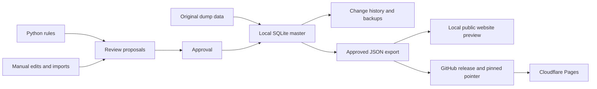

# Architecture

## The three parts

- **Public website:** React, TypeScript and Vite in `apps/web`. Cloudflare Pages
  serves the UI and approved JSON data; lookups run in the browser.
- **Local admin:** FastAPI with a plain JavaScript/CSS editor in `apps/admin`.
  It binds to localhost and opens in a browser. PyInstaller packages it for Windows.
- **Generator:** typed Python in `packages/engine`. It computes suggested forms
  independently of the editor or public website.

## Data flow

The first-run import uses extracted conjugations and pronouns from the supplied
`lazverbcon2.dump`. It does not regenerate its answers. An admin backup restores
that entire project, including later corrections, proposals and history.

The master is authoritative after review. Rules and imports propose changes;
approval replaces the relevant record. Generation cannot erase manual corrections.
Verb metadata edits are logged immediately. Only approved data reaches exports.

Publishing uploads an immutable ZIP and commits `published/catalog.json` with its
identity and checksum. Pages downloads that exact export and builds the UI.
Neither SQLite nor private history is uploaded as public website data.

## Module boundaries

| Location                                                | Responsibility                                          |
| ------------------------------------------------------- | ------------------------------------------------------- |
| `apps/admin/.../store.py`                               | Transactions, proposals, approval, undo and backups     |
| `apps/admin/.../publish.py`                             | Approved snapshot and GitHub publication                |
| `apps/admin/.../archive.py`                             | ZIP safety and checksum validation                      |
| `apps/admin/.../preview.py`                             | Local public-site snapshot preview                      |
| `apps/admin/.../launcher.py`                            | Persistent paths, one running editor and browser launch |
| `apps/api/.../catalog.py`, `static_export.py`           | Shared catalog format and public data export            |
| `apps/api/.../app.py`, `cli.py`                         | API contract and developer rule/catalog preview         |
| `apps/web/src/api/static.ts`                            | Browser lookups over JSON shards                        |
| `packages/engine/.../engine.py`, `paradigms/`, `rules/` | Rule dispatch and morphology                            |

The `apps/api` name reflects its original server role. Its contracts and exporter
are shared code still used by the admin, website types and tests. Removing this
package would require replacing those dependencies.

## Storage and previews

The admin stores its project outside the executable directory. One person owns
and updates the master. Handover uses a complete backup; no multi-editor sync exists.
OneDrive can sync completed backups while the working database stays local.

The packaged admin previews fixed exports. Frontend contributors use Vite for
automatic reload. Rule developers can run the local API; this does not edit the
approved master. See [local development](local-development.md).

Frozen rules in `migration/reference/` and fixtures in `tests/fixtures/` are
independent regression evidence. They are not a second application and are not
installed as part of the engine. See [rule development](rules.md).
